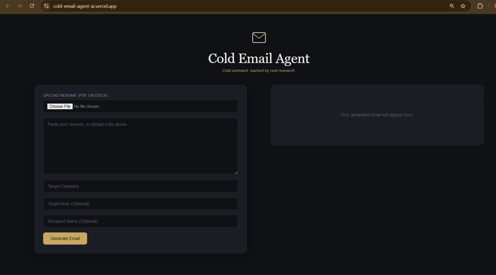
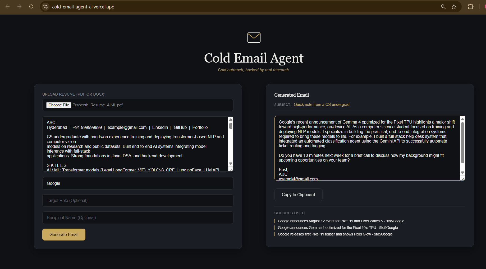

# Cold Email Agent



An AI-powered application that generates personalized cold emails by combining resume analysis with real-time company research.

Instead of producing generic templates, the application retrieves recent company updates, filters trustworthy sources, and uses Google Gemini to generate concise, context-aware outreach emails.

## 🌐 Live Demo

**Frontend:** https://cold-email-agent-ai.vercel.app

**Backend API:** https://cold-email-agent-q7l2.onrender.com

---

## ✨ Features

- Upload resumes in **PDF** or **DOCX** format
- Automatic resume text extraction
- Real-time company research using Tavily Search
- Filters low-quality and irrelevant sources
- Personalized email generation with Google Gemini
- AI-generated subject line
- Displays research sources used for generation
- One-click copy to clipboard
- Responsive modern UI

---

## 🛠 Tech Stack

### Frontend

- React
- Vite
- Axios
- CSS

### Backend

- FastAPI
- Python

### AI

- Google Gemini

### Retrieval

- Tavily Search API

### Deployment

- Vercel
- Render

---

## ⚙️ How It Works

```text
Resume
      │
      ▼
Resume Parsing
      │
      ▼
Company Research (Tavily)
      │
      ▼
Source Filtering
      │
      ▼
Prompt Builder
      │
      ▼
Google Gemini
      │
      ▼
Personalized Cold Email
      │
      ▼
Evidence Sources
```

---

## 📸 Screenshots

### Home


### Generated Email



---

## 🚀 Running Locally

### Clone the repository

```bash
git clone https://github.com/PraneethSai1810/cold-email-agent.git
cd cold-email-agent
```

---

### Backend Setup

```bash
cd backend

python -m venv venv

# Windows
venv\Scripts\activate

# macOS/Linux
source venv/bin/activate

pip install -r requirements.txt

uvicorn app:app --reload
```

Backend runs at:

```
http://127.0.0.1:8000
```

---

### Frontend Setup

```bash
cd frontend

npm install

npm run dev
```

Frontend runs at:

```
http://localhost:5173
```

---

## 🔑 Environment Variables

Create a `.env` file inside the **backend** directory.

```env
GEMINI_API_KEY=your_gemini_api_key
TAVILY_API_KEY=your_tavily_api_key
```

---

## 🔮 Future Improvements

- User Authentication
- Gmail & Outlook integration
- LinkedIn profile integration
- Portfolio integration
- Recruiter discovery
- Email analytics
- Subscription plans
- AI-powered follow-up email generation
- Company hiring insights

---

## 📄 License

This project is licensed under the MIT License.
